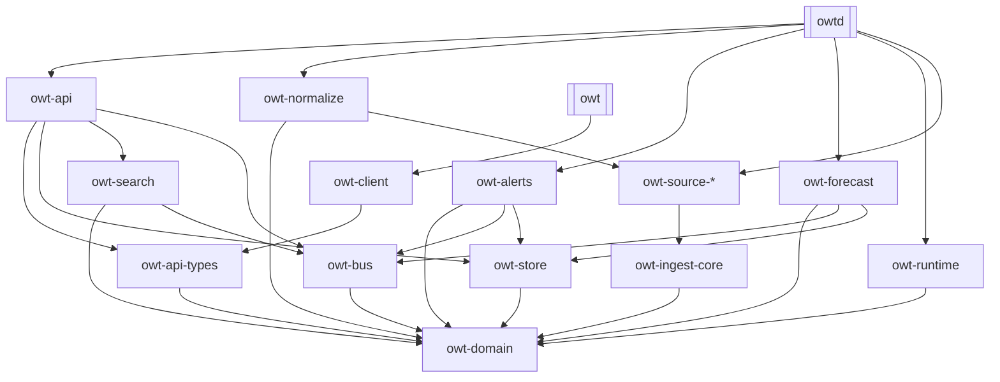

# Cargo workspace

One repository, one workspace. Two binaries — **`owtd`** (the server monolith) and **`owt`** (the TUI) — over a layered set of library crates. The crate graph *is* the module architecture: if a dependency edge would violate the layering rules, the design is wrong, not the rule.

## Crates

| Crate | Responsibility | Phase |
|---|---|---|
| `owt-domain` | Canonical entities (Market, Event, Trade, OrderFill, NewsItem, Comment, Entity, TimelineItem, PricePoint, BookSnapshot), ID newtypes, the ingest envelope, error taxonomy, alert-rule AST (v1). Pure types + serde; **zero I/O dependencies**. | MVP |
| `owt-api-types` | The public API contract: request/response DTOs, cursor pagination, RFC 7807 error bodies + error-code enum, WS frame protocol. The only crate the TUI may know besides `owt-client`. | MVP |
| `owt-runtime` | Shared bootstrap: layered config (figment: defaults → TOML → `OWT__*` env → CLI), tracing/OTel/Prometheus init, graceful shutdown, task supervision. | MVP |
| `owt-ingest-core` | `BackfillSource`/`StreamSource` traits, per-(source, endpoint-class) token buckets (`governor`), retry/backoff policies, checkpoint trait, raw-archive hook, DLQ publisher. | MVP |
| `owt-source-polymarket` | Gamma/CLOB/Data HTTP clients; `market` (+`sports`, `user` later) WS client; RTDS client. One crate, module per surface; owns source-native payload types. | MVP (RTDS/sports: v1) |
| `owt-source-news` | RSS poller + feed registry; GDELT client (news APIs v1+). | MVP |
| `owt-source-goldsky` | Goldsky V2 dataset ingestion, historical + streaming. | v1 |
| `owt-source-x` | X API adapters. | v2 |
| `owt-source-polygon` | Direct Polygon RPC indexer — reserved fallback ([ADR-0007](../adr/0007-goldsky-onchain-truth.md)). | reserved |
| `owt-normalize` | Source→canonical mapping, dedupe, entity resolution, timeline builder + correlation. Depends on source crates *only* for their payload types. | MVP |
| `owt-bus` | JetStream wrapper: subject constants, stream/consumer configs as code, `Nats-Msg-Id` dedupe publish, replay + rehydration helpers. | MVP |
| `owt-store` | sqlx repositories, idempotent upserts, checkpoint store, embedded migrations, continuous-aggregate management. | MVP |
| `owt-search` | Typesense collection schemas as code, thin REST client, indexer consumer, alias-swap rebuild job. | MVP |
| `owt-alerts` | Rule model, streaming evaluator, delivery. | v1 |
| `owt-forecast` | Model registry, streaming + scheduled signal computation, entity-odds aggregation, calibration jobs, rebuild path ([forecasts](../design/forecasts.md)). | v1 |
| `owt-api` | axum HTTP + WS server: query services, fanout subscriber, conflation, OpenAPI (utoipa). | MVP |
| `owt-client` | Typed Rust SDK over `owt-api-types` (reqwest + tokio-tungstenite) including the reconnect state machine — scripts get it free. | MVP |
| `owt-auth` | SIWE session verification, device-flow, workspace RBAC. | v2 |
| `owt-testkit` | Recorded-fixture harness, wiremock helpers, synthetic feed generator, golden-file utilities. Dev-dependency only. | MVP |
| **`owtd`** (bin) | Composition root. Subcommands: `serve --roles …`, `migrate`, `backfill`, `reindex`, `replay`, `forecast rebuild` (v1), `check-config`. | MVP |
| **`owt`** (bin) | The ratatui TUI. Depends **only** on `owt-client` + `owt-api-types` (+ ratatui/crossterm). | MVP |
| `xtask` | Dev automation: fixture capture, compose orchestration, dist packaging. | MVP |

## Dependency layering

**Rules (enforced in review and, later, by a CI dep-graph check):**

1. No crate depends "upward"; `owt-domain` and `owt-api-types` never depend on I/O crates (tokio ecosystem, sqlx, reqwest) — this keeps the TUI build lean and the contract portable.
2. The TUI touches server internals only through `owt-api-types`/`owt-client` — the compile-time enforcement of [ADR-0010](../adr/0010-rest-ws-api-protocol.md).
3. Source adapters never talk to `owt-store` — everything flows through the bus.
4. `owt-normalize` may import source payload *types*, never source *clients*.

## Workspace policy

- **Dependency versions** are declared once in `[workspace.dependencies]`; member crates inherit. New external deps need a justification line in the PR (supply-chain review: [ci-cd-and-release](../ops/ci-cd-and-release.md)).
- **Lints:** `rustfmt` default; clippy at `-D warnings` in CI with a small documented allow-list.
- **MSRV:** latest stable minus two, pinned in `Cargo.toml` and CI.
- **Features:** role modules compile unconditionally in MVP (roles are runtime flags, not features); Cargo features are reserved for optional adapters (e.g. `source-x`).
- **Layout:** `crates/*` for libraries, `bins/owtd`, `bins/owt`, `xtask/` at the root.

## Phasing

MVP builds 13 crates + 2 bins + xtask. `owt-alerts`, `owt-forecast`, `owt-source-goldsky` (v1), `owt-source-x`, `owt-auth` (v2), and `owt-source-polygon` (reserved) are listed now so subject names, schema slots, and dependency edges are designed for them — but no code lands early.

## Related

- [system-overview.md](system-overview.md)
- [../adr/0001-rust-backend.md](../adr/0001-rust-backend.md)
- [../adr/0003-modular-monolith.md](../adr/0003-modular-monolith.md)
