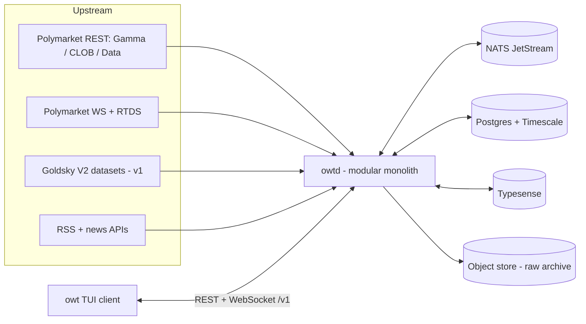
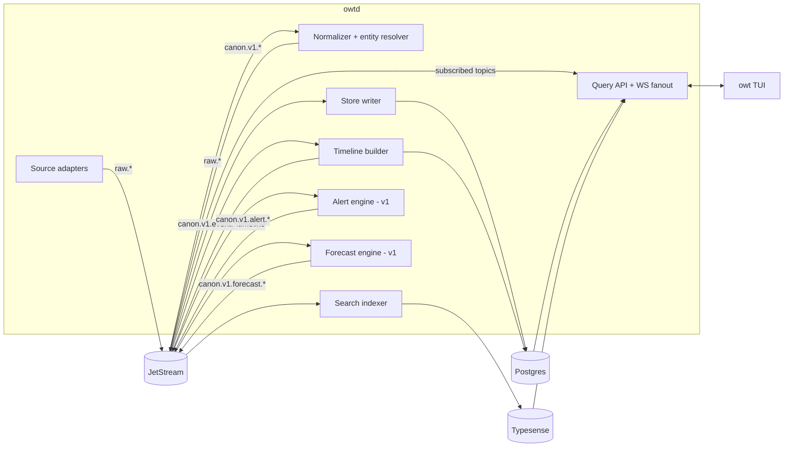

# System overview

owt is a **modular monolith with asynchronous workers** ([ADR-0003](../adr/0003-modular-monolith.md)): one server binary (`owtd`) whose modules communicate only through NATS JetStream, one native TUI client (`owt`) that speaks only the REST+WS API. The system's guiding invariant: **raw envelopes are replayable, canonical facts are append-only, and every derived store (search, candles, timelines) is rebuildable from Postgres.**

## Context

## Components

| Component | Responsibility | Crate(s) | Detail |
|---|---|---|---|
| Source adapters | Speak each upstream's protocol; emit raw envelopes; own rate budgets, checkpoints, reconnects | `owt-source-*`, `owt-ingest-core` | [ingestion](../design/ingestion.md) |
| Normalizer | Raw payload → canonical record; dedupe; entity resolution; versioned + deterministic | `owt-normalize` | [normalization](../design/normalization.md) |
| Store writer | Idempotent upserts of facts + snapshots into Postgres | `owt-store` | [storage](../design/storage.md) |
| Search indexer | Denormalized documents into Typesense; alias-swap rebuilds | `owt-search` | [search](../design/search.md) |
| Timeline builder | Correlates price moves with news/comments into `timeline_items` | `owt-normalize` (module) | [normalization](../design/normalization.md) |
| Alert engine (v1) | Streaming rule evaluation over `canon.v1.>` | `owt-alerts` | [alerts](../design/alerts.md) |
| Forecast engine (v1) | Statistical signals + aggregated entity odds as derived data over `canon.v1.market.>` | `owt-forecast` | [forecasts](../design/forecasts.md) |
| Query API + fanout | REST `/v1`, one WS per client, server-side conflation | `owt-api` | [query-api](../design/query-api.md) |
| TUI client | ratatui terminal; consumes only the API via `owt-client` | `owt` (bin) | [tui-client](../design/tui-client.md) |

There is **no separate realtime gateway** — WS fanout is a module of the API service — and **no Redis at MVP**: single-node hot state is an in-process cache (moka). Both are deliberate deviations from the research report ([roadmap § Divergences](../product/roadmap.md#divergences-from-the-research-report)).

## Flow 1 — a price tick reaches a pane

1. The Polymarket WS adapter holds a `market`-channel connection; a `price_change` for token `4833…` arrives.
2. Adapter wraps it in an envelope and publishes `raw.pm_ws.market.4833…` (dedupe key = `envelope_id`).
3. Normalizer consumes it, maps token → market/event, emits a canonical PricePoint to `canon.v1.market.12345.price`.
4. Store writer batches it into the `price_ticks` hypertable and updates the `market_state` snapshot row.
5. The API's fanout subscriber routes it to every client subscribed to `market:will-fed-cut…:state`, conflated to ≤10 Hz.
6. The TUI's WS task turns the frame into a `Msg`; `update()` mutates state; the pane re-renders. Budget: tick→pane p95 ≤ 750 ms.

## Flow 2 — a news item lands on a timeline

1. The RSS adapter polls a registered feed; a new item hashes to an unseen `news_id`.
2. Envelope → `raw.rss.{feed_id}` → normalizer: URL canonicalization, cross-source dedupe, entity resolution links it to the "Federal Reserve" entity → `event_links`/`market_links` populate.
3. Canonical NewsItem → `canon.v1.news.item.{news_id}` → three consumers in parallel: store writer (`news_items`), search indexer (`news` collection), timeline builder.
4. Timeline builder checks price movement in the correlation window around `published_at`; emits a TimelineItem with `numeric_delta` and confidence → `canon.v1.event.678.timeline` + `timeline_items` table.
5. Fanout delivers to any client viewing that event's timeline; the linked-news pane of related markets updates. Budget: publication→searchable p95 ≤ 2 min.

## Deployment shape

Single node by default: `owtd` (all roles) + Postgres/Timescale + NATS + Typesense (+ optional MinIO), via Docker Compose; the TUI is a distributed binary, not a deployed service. Production-initial splits roles across two `owtd` instances (api / workers) with managed Postgres. Full topology: [deployment](../ops/deployment.md).

## Scale-up triggers

Nothing below is adopted without its trigger being *measured and named* in an ADR:

| Candidate | Trigger |
|---|---|
| Redis | multi-instance API fanout needing shared hot state, or v2 session store |
| ClickHouse | sustained analytical scans over billions of fact rows degrading Postgres |
| OpenSearch | search becomes aggregation/analytics-shaped beyond Typesense |
| Redpanda/Kafka | sustained >10k msgs/s or external consumers needing Kafka compatibility |
| Kubernetes | more than a handful of role-scoped instances, or multi-tenant hosting |
| `owt-source-polygon` (self-indexer) | Goldsky unavailable, unaffordable, or unverifiable (D-05) |

## Cross-cutting

- **Observability:** OTel traces across bus hops, Prometheus metrics, structured logs — [observability](../ops/observability.md).
- **Security:** localhost-bind default, no PII through v1 — [security-and-privacy](../ops/security-and-privacy.md), [ADR-0008](../adr/0008-read-only-through-v1.md).
- **Testing:** every arrow above has a contract or integration test — [testing-strategy](../ops/testing-strategy.md).

## Related

- [cargo-workspace.md](cargo-workspace.md)
- [data-model.md](data-model.md)
- [data-sources.md](data-sources.md)
- [../adr/0003-modular-monolith.md](../adr/0003-modular-monolith.md)
- [../ops/deployment.md](../ops/deployment.md)
