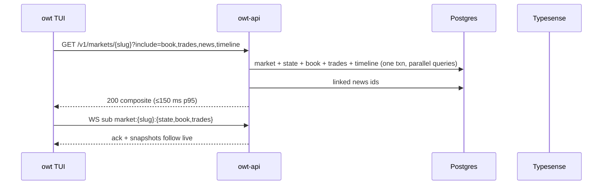

# Query API & realtime fanout

`owt-api` (axum) serves REST under `/v1` plus one multiplexed WebSocket per client ([ADR-0010](../adr/0010-rest-ws-api-protocol.md)). The contract is the `owt-api-types` crate; OpenAPI (utoipa) is generated for non-Rust consumers. WS fanout is a module here — there is no separate gateway.

## REST endpoints (MVP)

| Method & path | Returns | Notes |
|---|---|---|
| `GET /v1/health`, `GET /v1/version` | liveness; build info + API version | health includes per-dependency status |
| `GET /v1/markets` | market summaries | filters `status, tag, event, q`; sorts `liquidity, volume, updated`; cursor pagination |
| `GET /v1/markets/{slug}` | Market + `market_state` | composite header data |
| `GET /v1/markets/{slug}/book` | latest BookSnapshot | top-N levels; `?levels=` |
| `GET /v1/markets/{slug}/prices` | candles | `?resolution=1m\|5m\|1h\|1d&from&to`; server downsamples to ≤ 2,000 points |
| `GET /v1/markets/{slug}/trades` | trade tape | cursor, newest-first |
| `GET /v1/markets/{slug}/news` | linked NewsItems | via entity links; cursor |
| `GET /v1/markets/{slug}/timeline` | TimelineItems (market-scoped) | cursor |
| `GET /v1/events` | event summaries | filters/sorts/cursor as markets |
| `GET /v1/events/{slug}` | Event + member market summaries | |
| `GET /v1/events/{slug}/timeline` | TimelineItems | the flagship endpoint; cursor |
| `GET /v1/search` | federated results | `?q=&types=&filters=` DSL ([search](search.md)); `degraded` flag |
| `GET /v1/news` / `GET /v1/news/{id}` | news list / item | filters `entity, publisher, market`; cluster-aware |
| `GET /v1/entities/{id}` | Entity + links; composite topic page via `?include=markets,events,news:10,odds` | the topic-lookup read ([topic-lookup](topic-lookup.md)); odds derived on read at MVP |
| *(v1)* `GET /v1/markets/{slug}/forecasts` | latest forecast values per model + horizon; `?model=&from=&to=` history | [forecasts](forecasts.md) |
| *(v1)* `GET /v1/entities/{id}/forecasts` | entity-scoped model outputs | [forecasts](forecasts.md) |
| *(v1)* `GET /v1/entities/{id}/odds` | EntityOdds document | also served as `include=odds` on the composite |
| *(v1)* `GET /v1/models` | model registry: id, version, kind, methodology, status | [forecasts](forecasts.md) |
| `GET/POST/PATCH/DELETE /v1/watchlists…` | watchlist CRUD | `default` workspace pre-auth |
| `GET/POST/DELETE /v1/views…` | saved-view CRUD | layout JSON round-trips opaquely |
| *(v1)* `…/v1/alerts/rules…`, `GET /v1/alerts/events` | alert CRUD + inbox | [alerts](alerts.md) |

**Admin surface is not under `/v1`:** operational actions (`/admin/ingest/status`, `/admin/backfill`, `/admin/reindex`) bind to a separate localhost-only port, doubling as `owtd` subcommands. They are unversioned and unsupported for external use.

## Composite screen loads

The market-detail screen issues **one** `GET /v1/markets/{slug}?include=book,trades:20,news:10,timeline:20` — an explicit `include` expansion so the TUI paints in a single round trip, with per-include row caps. Sequence:



## WebSocket protocol

One socket per client at `GET /v1/ws` (upgrade). All frames JSON, typed in `owt-api-types`, protocol-versioned.

**Client → server:**

```json
{ "op": "hello", "proto": 1, "client": "owt/0.1.0" }
{ "op": "sub",   "topics": ["market:will-fed-cut:state", "market:will-fed-cut:book", "watchlist:42"] }
{ "op": "unsub", "topics": ["market:will-fed-cut:book"] }
{ "op": "ping",  "t": 1751900102 }
```

**Server → client:**

```json
{ "op": "welcome", "proto": 1, "session": "…", "resume": false }
{ "op": "ack", "sub": ["…"], "invalid": [] }
{ "op": "event", "topic": "market:will-fed-cut:state", "seq": 812, "data": { "…MarketStateDelta…": 1 } }
{ "op": "snapshot", "topic": "market:will-fed-cut:book", "seq": 813, "data": { "…BookSnapshot…": 1 } }
{ "op": "lagged", "topic": "…", "resync": true }
{ "op": "pong", "t": 1751900102 }
```

**Topics (public contract, distinct from internal bus subjects):** `market:{slug}:state|book|trades`, `event:{slug}:timeline`, `watchlist:{id}`, `alerts` *(v1)*, `market:{slug}:forecasts` *(v1)*, `entity:{id}:odds` *(v1)*, `system` (server notices).

**Semantics:**

- Per-topic `seq` (monotonic per connection). After reconnect the client re-subs; the server replies with a fresh `snapshot` then deltas — **snapshot + deltas is the only resume model** (no server-side session resumption in MVP; `resume: false` always).
- **Conflation:** book/state topics coalesce to latest at 4–10 Hz per client (forecast/odds topics *(v1)* likewise coalesce to latest); trade topics deliver every event up to a per-topic buffer.
- **Slow clients:** bounded per-client queue (1,000 frames); overflow drops oldest conflatable frames and injects `lagged` with `resync: true` for affected topics; a client ignoring `lagged` for 30 s is disconnected with a coded close frame.
- Heartbeat: client pings every 15 s; server closes after 45 s silence.
- Caps: ≤ 200 subscribed topics per connection (MVP), one connection per client process.

## Pagination

Opaque cursor = base64 of `(ts, id)` of the last row; `?limit=` capped at 200 (default 50). Stable order `(ts DESC, id DESC)`. **Offset pagination is rejected** on fact tables — it lies on hypertables under concurrent inserts. List responses:

```json
{ "data": [ … ], "cursor": { "next": "b64…", "has_more": true } }
```

## Errors

RFC 7807 `application/problem+json`, with a closed error-code enum shared in `owt-api-types`:

```json
{ "type": "https://owt.dev/errors/rate-limited", "title": "Rate limited",
  "status": 429, "code": "RATE_LIMITED", "retry_after_ms": 800, "detail": "…" }
```

Codes (MVP): `NOT_FOUND`, `INVALID_QUERY` (DSL errors carry a caret position for palette hints), `RATE_LIMITED`, `DEGRADED_SEARCH`, `VALIDATION`, `CONFLICT`, `INTERNAL`, `UNAVAILABLE`. 5xx bodies never leak internals; correlation id header `x-owt-request-id` always present.

## Versioning & auth posture

- `/v1` is **additive-only**: new fields/endpoints/topics may appear any release; nothing is removed or retyped without `/v2`. The WS `proto` field gates frame-format changes. Server/client skew policy: lockstep at MVP, semver compatibility from v1 ([ci-cd-and-release](../ops/ci-cd-and-release.md)).
- **Auth (MVP):** binds `127.0.0.1` by default. Remote self-host: set `api.bind` + `api.bearer_token` (static, config/env); requests then require `Authorization: Bearer …`. That header slot is the forward-compatible seam v2 SIWE sessions fill ([ADR-0008](../adr/0008-read-only-through-v1.md)).
- Server-side per-client rate limiting (tower middleware): 50 req/s REST per connection/token, WS sub churn ≤ 20 ops/s — protects self-hosts from runaway scripts.

## Latency budgets (server-side, warm; k6-enforced from v1)

| Endpoint class | p95 | p99 |
|---|---|---|
| list/cursor pages | 100 ms | 250 ms |
| market-detail composite | 150 ms | 400 ms |
| topic composite (incl. read-time odds) | 250 ms | 600 ms |
| forecasts reads *(v1)* | 100 ms | 250 ms |
| search | 100 ms (Typesense inner ≤ 30 ms) | 250 ms |
| candles (≤ 2,000 pts) | 250 ms | 600 ms |
| timeline | 200 ms | 500 ms |
| WS fanout (bus msg → client frame) | 150 ms | 400 ms |

Caching: `ETag` on list endpoints, `Cache-Control: max-age=5` on candles/reference reads; conditional requests honored.

**Disclosure (v1, normative):** every forecasts/odds response carries `model_id`, `model_version`, `kind` (`signal` | `forecast`) per value and a top-level `disclosure: "Statistical model output for research purposes; not financial advice."` — clients must render the label and version wherever a value is shown ([ADR-0012](../adr/0012-forecast-derived-data-module.md)).

## Testing

Contract tests drive `owt-client` against `owt-api` with a seeded store per PR; the OpenAPI document is diffed in CI (additive-only enforcement); WS protocol has a scripted conformance suite (sub/unsub/lag/resync/reconnect) in `owt-testkit` ([testing-strategy](../ops/testing-strategy.md)).

## Related

- [../adr/0010-rest-ws-api-protocol.md](../adr/0010-rest-ws-api-protocol.md)
- [../architecture/cargo-workspace.md](../architecture/cargo-workspace.md)
- [realtime-bus.md](realtime-bus.md)
- [tui-client.md](tui-client.md)
