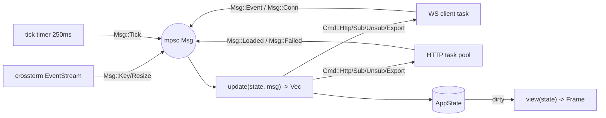

# TUI client (`owt`)

A single Rust binary on **ratatui + crossterm**, speaking only the REST+WS API through `owt-client` ([ADR-0002](../adr/0002-ratatui-tui-first-client.md)). Screens and features it must deliver: [prd-mvp](../product/prd-mvp.md).

## Architecture — TEA over tokio

The Elm Architecture: one state, one message enum, a pure update function, a view function. Side effects live in tokio tasks that feed messages into a single channel.



- **`update()` is pure** (state + Msg → state mutations + `Vec<Cmd>`); all I/O is a `Cmd` executed by the runtime layer. This is what makes the client unit-testable without a terminal.
- **Render policy:** draw only when state is dirty or on tick; never per-message. Conflated data topics mean the WS task already bounds inbound rates.

## AppState

```rust
pub struct AppState {
    route_stack: Vec<Route>,            // navigation with back
    screens: ScreenStates,              // per-screen state structs
    cache: DataCache,                   // normalized, keyed by slug/id
    subs: SubscriptionRegistry,         // topic -> refcount (panes share subs)
    conn: ConnState,                    // Connected|Degraded|Reconnecting|Offline
    palette: PaletteState,              // input, completions, history
    toasts: Vec<Toast>,                 // transient notices
    alert_inbox: InboxState,            // v1
    cfg: EffectiveConfig,
}
```

- **DataCache:** every record carries `fetched_at` + source (`rest` | `ws`); staleness = age > topic-specific TTL → pane shows an age badge. WS events invalidate/patch cache entries (`market_state` deltas patch in place; `meta` changes trigger refetch).
- **SubscriptionRegistry:** panes declare topic needs; the registry refcounts and diffs against the server (sub on first use, unsub on last close, full re-sub after reconnect).
- **Optimistic mutations:** the only writes are watchlist/view CRUD — apply locally, send, revert with a toast on failure.

## Screens, panes, layout

Screens (= routes): `Search`, `MarketDetail`, `EventWorkspace`, `TopicView`, `Watchlists`, `AlertInbox` *(v1)*, `Help` (overlay). A screen is a **layout tree** of splits containing panes; focus moves across leaves.

- Market detail default: header + `[book | tape | news]` columns + timeline strip (the PRD wireframe).
- Event workspace: query bar + `[market list | live timeline]`.
- Topic view: entity header + `[odds board | linked news | related]` + forecast strip *(v1)* ([topic-lookup](topic-lookup.md)); forecast values always render their model label + version and the research disclosure ([ADR-0012](../adr/0012-forecast-derived-data-module.md)).
- Layout trees serialize into saved views (server-side JSON, opaque to the API).
- **Resize/degradation:** breakpoints at 120 and 96 columns collapse columns into tabs; minimum 80×24 shows a single-pane mode. Resize never corrupts — layout recomputes from the tree, no absolute coordinates in state.

## Command palette & grammar

Activated with `:` (or `/` — both open it, muscle-memory friendly). Grammar (shared parser in `owt-domain`, also used by search filters and v1 alert predicates):

```ebnf
command   = "/" verb [ ws args ] ;
verb      = "open" | "topic" | "watch" | "unwatch" | "pin" | "compare" | "news"
          | "export" | "view" | "alert" | "help" | "quit" ;
args      = { arg ws } arg ;
arg       = ident | quoted | filter ;
filter    = key ":" [ op ] value ;      (* tag:politics  liquidity:>10000 *)
op        = ">" | "<" | ">=" | "<=" ;
```

- Completion is server-driven: palette input debounced 150 ms against `/v1/search` (entities + markets + commands); accepted completion inserts the slug.
- Errors from `INVALID_QUERY` render inline with the caret position the API returns ([query-api § errors](query-api.md#errors)).
- `/alert` parses in MVP but responds "alerts arrive in v1".

## Keybindings (default map)

| Key | Action |
|---|---|
| `:` `/` | command palette |
| `h j k l` / arrows | move within pane / lists |
| `Tab` / `Shift-Tab` | cycle pane focus |
| `Enter` | open selection |
| `Esc` | close overlay / back (`route_stack.pop`) |
| `g g` / `G` | top / bottom of list |
| `w` | toggle watch on selection |
| `1..9` | jump to watchlist n |
| `?` | help overlay |
| `q` / `Ctrl-C` | quit (double-tap if unsaved palette input) |

User remapping via `[keys]` table in config; unknown actions error at startup with the offending line. No mouse requirement anywhere; mouse scroll/click supported where free.

## Rendering & performance budgets

- Frame budget **≤ 16 ms** at 200×60 (typical full redraw well under it; `--debug` overlay shows FPS, frame time, WS lag, dropped frames).
- Input echo (keypress → visible effect) **≤ 50 ms**.
- Book/tape panes render from conflated streams (4–10 Hz) — cell-level diffing is ratatui's job; owt's job is not to re-layout on every tick (layout tree memoized until resize/focus change).
- List virtualization: tape/news/timeline panes render only visible rows over ring buffers (caps: tape 1,000 rows, timeline 500).
- Memory **≤ 150 MB RSS** with 10 live market subscriptions.
- Cold start → interactive **≤ 2 s** (parallel: config load, REST snapshot of route, WS connect).

## Connection lifecycle

`ConnState` drives the status bar: `Connected` (green dot) → `Degraded` (yellow; WS down, REST ok — panes show age badges) → `Reconnecting` (backoff 1→2→4…60 s jittered) → `Offline` (REST failing too; cached data + banner).

On WS reconnect: re-sub the registry, expect `snapshot` per topic, patch cache, clear badges — target ≤ 30 s to consistent after network restore. REST calls carry independent retry (2 attempts, then toast). No local disk cache in MVP (open decision D-09): cold data comes from the server each launch.

## Terminal hygiene

- **Panic hook** restores the terminal (leave alt-screen, show cursor, disable raw mode) before printing the panic — a corrupted terminal is an instant-uninstall bug.
- Logs to `$XDG_STATE_HOME/owt/owt.log` (rotating, level via config/`--log`); **never stdout/stderr** while the UI runs. No telemetry from the client, ever, by default ([observability](../ops/observability.md)).
- Color: truecolor detected → 256-color fallback → 16-color monochrome-safe theme; themes in config.
- Compatibility matrix (CI smoke + manual): macOS Terminal/iTerm2/kitty, Linux gnome-terminal/alacritty/kitty, Windows Terminal, tmux/screen, plain ssh. Min 80×24.

## Configuration

`$XDG_CONFIG_HOME/owt/config.toml` (flags override; `OWT__*` env between):

```toml
[server]
url = "http://127.0.0.1:8080"
# bearer_token = "…"            # remote self-host

[ui]
theme = "dark"
tick_ms = 250
tape_rows = 1000

[keys]
# palette = ":"                 # remap example

[profiles.staging]
server.url = "https://owt.example.dev"
```

Profiles switch with `owt --profile staging`. Config schema lives in `owt-client` so scripts share it.

## Packaging & distribution

- **cargo-dist** builds signed archives per release: macOS (x86_64, aarch64), Linux (x86_64, aarch64, musl static), Windows (x86_64) — attached to GitHub Releases ([ci-cd-and-release](../ops/ci-cd-and-release.md)).
- `cargo install owt-tui` works from day one; Homebrew tap once releases stabilize.
- Version handshake: `owt` sends its version in `hello`; server replies `welcome` or a coded close (`UPGRADE_REQUIRED`) per the skew policy.

## Test plan

1. **`update()` unit tests** — pure function, no terminal: given state+Msg, assert state+Cmds (bulk of coverage).
2. **Golden frames** — `ratatui::TestBackend` renders screens from fixture state; `insta` snapshots diff on change. One golden per screen per breakpoint (200×60, 120×40, 80×24).
3. **Integration** — TUI against a `owt-testkit` mock server (wiremock REST + scripted WS): reconnect, lagged/resync, degraded search.
4. **PTY smoke** — `expectrl` drives the real binary in a PTY through the PRD demo script's key sequence; asserts on screen scrapes. This replaces the browser E2E gate ([testing-strategy](../ops/testing-strategy.md)).

## Related

- [../adr/0002-ratatui-tui-first-client.md](../adr/0002-ratatui-tui-first-client.md)
- [query-api.md](query-api.md)
- [../product/prd-mvp.md](../product/prd-mvp.md)
- [../ops/testing-strategy.md](../ops/testing-strategy.md)
