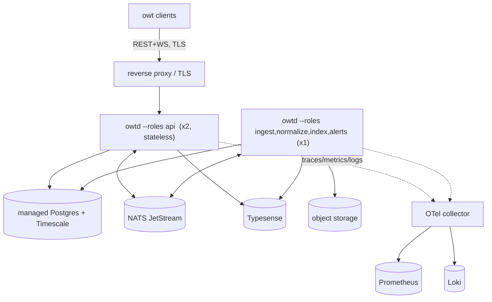

# Deployment

Two supported shapes at MVP: **local/self-host** (Docker Compose, one machine) and **production-initial** (single region, role-split owtd). The TUI is never deployed — it's a distributed binary ([ci-cd-and-release](ci-cd-and-release.md)).

> **Status — target design.** This describes the intended deployment. The `owtd` server
> is currently a scaffold (subcommands parse but print "not yet implemented"), and the
> Compose stack, `.env.example`, and migrations below do not exist yet. For what runs
> today, see [getting-started](getting-started.md).

## Local & self-host (canonical): Docker Compose

Four services plus the app — Redis is deliberately absent ([roadmap divergence 4](../product/roadmap.md#divergences-from-the-research-report)):

| Service | Image (pinned) | Ports (localhost) | Volume |
|---|---|---|---|
| `postgres` | timescale/timescaledb (PG16) | 5432 | `pgdata` |
| `nats` | nats (JetStream enabled) | 4222 | `natsdata` |
| `typesense` | typesense/typesense | 8108 | `tsdata` |
| `minio` *(optional profile)* | minio/minio | 9000 | `miniodata` — omit to use filesystem raw archive |
| `owtd` | ghcr.io/…/owtd | **8080** (API), 8081 (admin, localhost-only) | `owtdata` (filesystem archive fallback) |

First run:

```bash
cp .env.example .env          # secrets + budgets; never commit .env
docker compose up -d
docker compose exec owtd owtd migrate
docker compose exec owtd owtd backfill --top 200 --days 30
owt                            # TUI from a release binary, talks to 127.0.0.1:8080
```

- The `owtd migrate`/`backfill` invocations above are the **target** CLI. The current scaffold accepts a narrower shape (e.g. `owtd backfill <source>`, no `--top`/`--days`) — see [getting-started § the owtd server](getting-started.md#the-owtd-server-scaffold).
- `.env.example` documents every variable with a sane default: `OWT__DB__URL`, `OWT__NATS__URL`, `OWT__TYPESENSE__{URL,API_KEY}`, `OWT__API__{BIND,BEARER_TOKEN}`, `OWT__ARCHIVE__{MODE,PATH,S3_*}`, per-source budget overrides.
- Config precedence everywhere: defaults → TOML → `OWT__*` env → CLI flags ([cargo-workspace](../architecture/cargo-workspace.md)).
- Dev loop outside Docker: `docker compose up postgres nats typesense` + `cargo run -p owtd -- serve` — supported and CI-tested.

## Production-initial (single region)



- **API instances are stateless** (fanout resnapshots from the store); the worker role runs single-instance at this stage — its jobs are checkpointed, so failover is restart-based, not HA.
- TLS terminates at the proxy; `owtd` still sets a bearer token (defense in depth). No CDN/static tier exists — there is no web bundle.
- Managed Postgres with PITR; NATS and Typesense self-hosted on the same node class until a named trigger says otherwise.

## Migrations flow

1. Deploy pauses workers (`owtd` drains consumers on SIGTERM within 30 s).
2. `owtd migrate` runs explicitly — never on boot in production ([storage § migrations](../design/storage.md#migrations)).
3. New version starts; forward-only schema means old API instances tolerate the new schema during the overlap window (additive-only rule).
4. Rollback = redeploy previous image; schema stays (additive), data unaffected.

## Environments

| Env | Purpose | Data |
|---|---|---|
| `dev` (compose) | daily development | seeded fixtures + small live backfill |
| `staging` *(from v1)* | pre-release soak, k6 perf gate | full live ingest, disposable |
| `prod` | the hosted instance question is open decision D-03 | — |

## Scale triggers

Adopt nothing without measuring its trigger ([system-overview § scale-up](../architecture/system-overview.md#scale-up-triggers)): Redis (multi-instance fanout state / v2 sessions) · ClickHouse (analytical scans hurting Postgres) · Redpanda/Kafka (>10k msgs/s sustained) · Kubernetes (fleet of role instances) · OpenSearch (analytics-shaped search).

## Related

- [../architecture/system-overview.md](../architecture/system-overview.md)
- [../design/storage.md](../design/storage.md)
- [ci-cd-and-release.md](ci-cd-and-release.md)
- [getting-started.md](getting-started.md)
